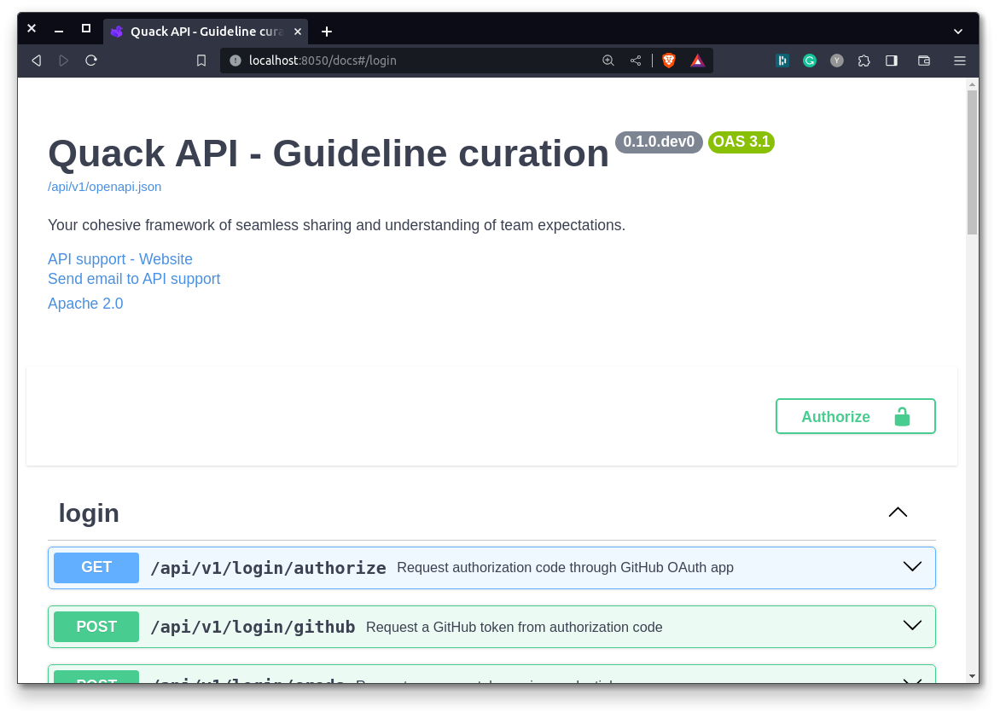

<p align="center">
  <a href="https://quackai.com"></a>
</p>
<h1 align="center">
 Quack - API for contribution assistance
</h1>
<p align="center">
  <a href="https://github.com/quack-ai/companion">VSCode extension</a> ・
  <a href="https://github.com/quack-ai/contribution-api">Backend API</a> ・
  <a href="https://github.com/quack-ai/platform">Frontend dashboard</a> ・
  <a href="https://docs.quackai.com">Documentation</a>
</p>
<h2 align="center"></h2>

<p align="center">
  <a href="https://github.com/quack-ai/contribution-api/actions?query=workflow%3Abuilds">
    
  </a>
  <a href="https://github.com/astral-sh/ruff">
    
  </a>
  <a href="https://www.codacy.com/gh/quack-ai/contribution-api/dashboard?utm_source=github.com&amp;utm_medium=referral&amp;utm_content=quack-ai/contribution-api&amp;utm_campaign=Badge_Grade"></a>
  <a href="https://codecov.io/gh/quack-ai/contribution-api">
    
  </a>
</p>
<p align="center">
  
  <a href="https://hub.docker.com/repository/docker/quackai/contribution-api">
    
  </a>
  <a href="https://github.com/quack-ai/contribution-api/blob/main/LICENSE">
    
  </a>
</p>
<p align="center">
  <a target="_blank" href="https://discord.gg/E9rY3bVCWd" style="background:none">
    
  </a>
  <a href="https://twitter.com/quack_ai">
    
  </a>
</p>


## Quick Tour

### Running/stopping the service

You can run the API containers using this command:

```shell
make run
```

You can now navigate to [`http://localhost:8050/docs`](http://localhost:8050/docs) to interact with the API (or do it through HTTP requests) and explore the documentation.



In order to stop the service, run:
```shell
make stop
```


### How is the database organized

The back-end core feature is to interact with the metadata tables. For the service to be useful for codebase analysis, multiple tables/object types are introduced and described as follows:

#### Access-related tables

- Users: stores the hashed credentials and access level for users & devices.

#### Core worklow tables

- Repository: metadata of installed repositories.
- Guideline: metadata of curated guidelines.


## Installation

### Prerequisites

- [Docker](https://docs.docker.com/engine/install/)
- [Docker compose](https://docs.docker.com/compose/)
- [Make](https://www.gnu.org/software/make/) (optional)

The project was designed so that everything runs with Docker orchestration (standalone virtual environment), so you won't need to install any additional libraries.

## Configuration

In order to run the project, you will need to specific some information, which can be done using a `.env` file.
This file will have to hold the following information:
- `SUPERADMIN_GH_PAT`: the GitHub token of the initial admin access (Generate a new token on [GitHub](https://github.com/settings/tokens?type=beta), with no extra permissions = read-only)
- `SUPERADMIN_PWD`*: the password of the initial admin access
- `GH_OAUTH_ID`: the Client ID of the GitHub Oauth app (Create an OAuth app on [GitHub](https://github.com/settings/applications/new), pointing to your Quack dashboard w/ callback URL)
- `GH_OAUTH_SECRET`: the secret of the GitHub Oauth app (Generate a new client secret on the created OAuth app)
- `POSTGRES_DB`*: a name for the [PostgreSQL](https://www.postgresql.org/) database that will be created
- `POSTGRES_USER`*: a login for the PostgreSQL database
- `POSTGRES_PASSWORD`*: a password for the PostgreSQL database
- `OPENAI_API_KEY`: your API key for Open AI (Create new secret key on [OpenAI](https://platform.openai.com/api-keys))

_* marks the values where you can pick what you want._

Optionally, the following information can be added:
- `SECRET_KEY`*: if set, tokens can be reused between sessions. All instances sharing the same secret key can use the same token.
- `SENTRY_DSN`: the DSN for your [Sentry](https://sentry.io/) project, which monitors back-end errors and report them back.
- `SERVER_NAME`*: the server tag that will be used to report events to Sentry.
- `POSTHOG_KEY`: the project API key for PostHog [PostHog](https://eu.posthog.com/settings/project-details).
- `SLACK_API_TOKEN`: the App key for your Slack bot (Create New App on [Slack](https://api.slack.com/apps), go to OAuth & Permissions and generate a bot User OAuth Token).
- `SLACK_CHANNEL`: the Slack channel where your bot will post events (defaults to `#general`, you have to invite the App to your channel).
- `SUPPORT_EMAIL`: the email used for support of your API.
- `DEBUG`: if set to false, silence debug logs.

So your `.env` file should look like something similar to [`.env.example`](.env.example)
The file should be placed in the folder of your `./docker-compose.yml`.

## Contributing

Any sort of contribution is greatly appreciated!

You can find a short guide in [`CONTRIBUTING`](CONTRIBUTING.md) to help grow this project! And if you're interested, you can join us on [](https://discord.gg/E9rY3bVCWd)


## Copying & distribution

Copyright (C) 2023, Quack AI.

This program is licensed under the Apache License 2.0.
See LICENSE or go to <https://www.apache.org/licenses/LICENSE-2.0> for full license details.

[](https://app.fossa.com/projects/git%2Bgithub.com%2Fquack-ai%2Fcontribution-api?ref=badge_large&issueType=license)
